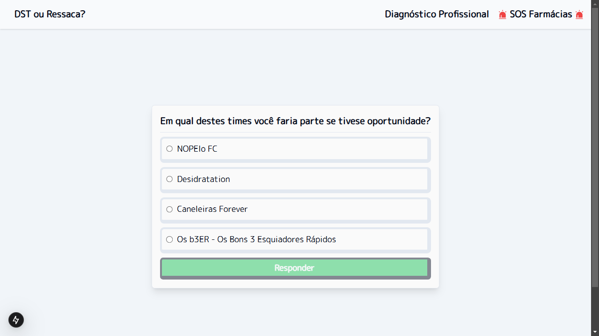
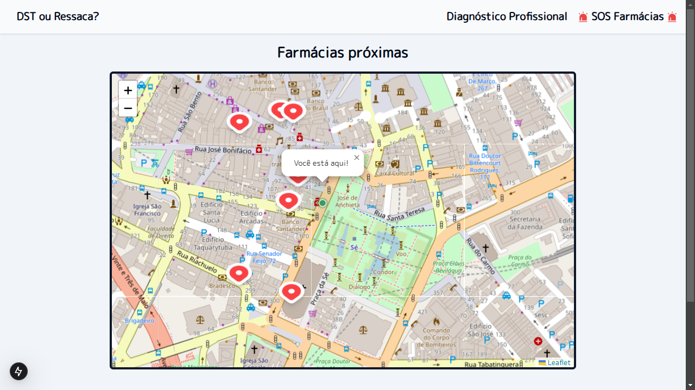

# 🎉 DST ou Ressaca?

🔗 Link do projeto (inexistente por hora)

## ℹ️ Sobre

O projeto consiste em uma ferramente que pode ser muito útil em tempos de Carnaval: um site que faz um diagnóstico e descobre se você possui uma DST ou uma ressaca. Além disso, para facilitar ainda mais, possui um mapa que mostra as farmácias próximas de você

### 🏠 Página inicial


### 🩺 Primeira pergunta do diagnóstico



### 📍 Farmácias próximas de você (Ex: Praça da Sé)



## 🛠️ Stack


### 🔨 Demais tecnologias

canvas-confetti: [https://github.com/catdad/canvas-confetti#readme](https://github.com/catdad/canvas-confetti#readme)
overpass-api: [https://wiki.openstreetmap.org/wiki/Overpass_API](https://wiki.openstreetmap.org/wiki/Overpass_API)

## 👨‍💻 Como executar?

### ⬇️ Instale o Node.js

[Baixar o Node.js aqui!](https://nodejs.org/pt/download)

### ⬇️ Instale o PNPM

[Baixe o pnpm aqui!](https://pnpm.io/installation)

### 📂 Clone o repositório

```bash
git clone https://github.com/rafaelsantiagosilva/dst-ou-ressaca.git
```

### ⬇️ Instale as dependências

- Abra a pasta do projeto no terminal
- Rode o seguinte comando:

```bash
pnpm install
```

### ⌨️ Rode os comandos...

```shell
pnpm build
pnpm start
```

### 🌐 Abra no navegador...

[http://localhost:3000](http://localhost:3000)
